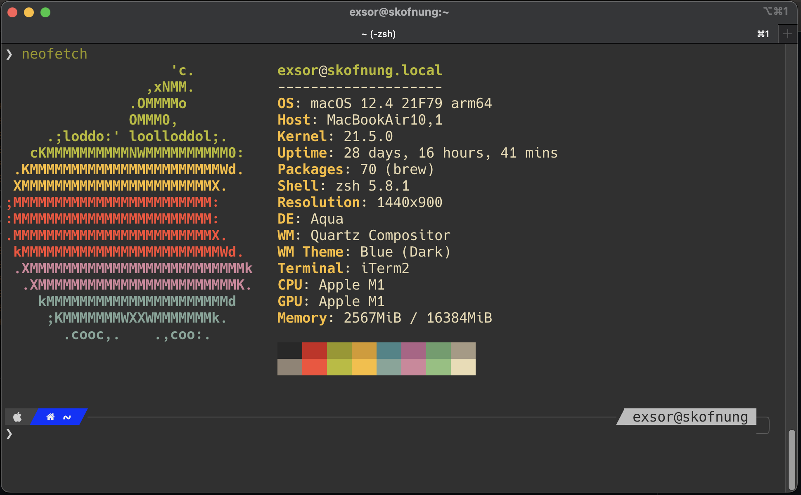

# My OhMyZsh Setup

## Install Oh My Zsh with curl

`sh -c "$(curl -fsSL https://raw.githubusercontent.com/ohmyzsh/ohmyzsh/master/tools/install.sh)"`

Note: You need to have ZSH installed before installing Oh My Zsh. Have a look at [Installing ZSH](https://github.com/ohmyzsh/ohmyzsh/wiki/Installing-ZSH)

## Using my customized theme - xtheme. 

I customized robbyrussell.zsh-theme to add hostname in the prompt. The ordinal can by found here: https://github.com/ohmyzsh/ohmyzsh/blob/master/themes/robbyrussell.zsh-theme

### Download xtheme by

`curl -o $ZSH_CUSTOM/themes/xtheme.zsh-theme https://raw.githubusercontent.com/eXsoR65/my-ohmyzsh-setup/main/xtheme.zsh-theme`

- `nano ~/.zshrc` and find ZSH_THEME="robbyrussell"
-  Change it to ZSH_THEME="xtheme"

## Enabling Plugins (zsh-autosuggestions & zsh-syntax-highlighting)
 - Download zsh-autosuggestions by
 
 `git clone https://github.com/zsh-users/zsh-autosuggestions.git $ZSH_CUSTOM/plugins/zsh-autosuggestions`
 
 - Download zsh-syntax-highlighting by
 
 `git clone https://github.com/zsh-users/zsh-syntax-highlighting.git $ZSH_CUSTOM/plugins/zsh-syntax-highlighting`

 - Modify you .zshrc file to add the plugins Example: `nano ~/.zshrc`
 
 - Append `zsh-autosuggestions & zsh-syntax-highlighting` to  plugins()
 Should look like this: `plugins=(git zsh-autosuggestions zsh-syntax-highlighting)`
 
 - Reload your .zshrc to apply changes with `source ~/.zshrc`.

 ### Ref
 - [oh-my-zsh](https://github.com/robbyrussell/oh-my-zsh)
 - [zsh-autosuggestions](https://github.com/zsh-users/zsh-autosuggestions)
 - [zsh-syntax-highlighting](https://github.com/zsh-users/zsh-syntax-highlighting)
